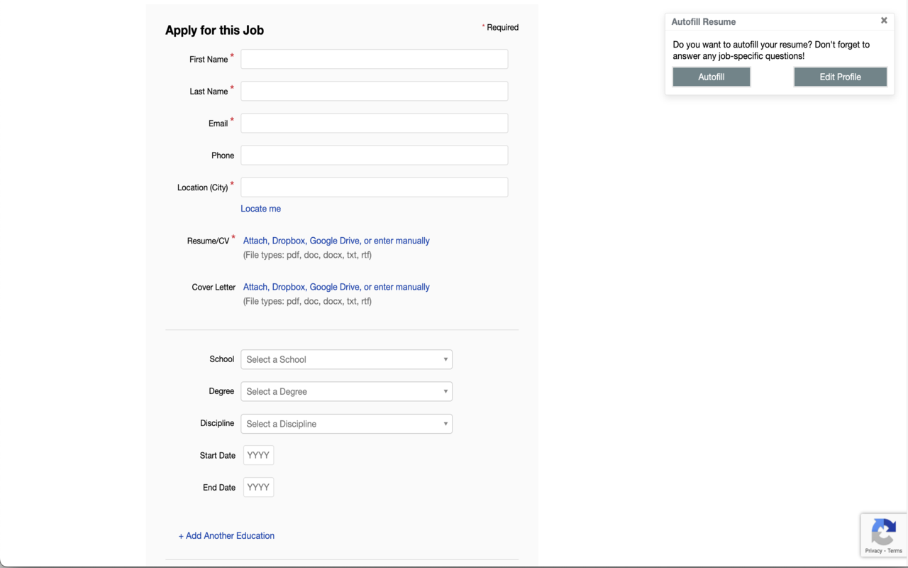
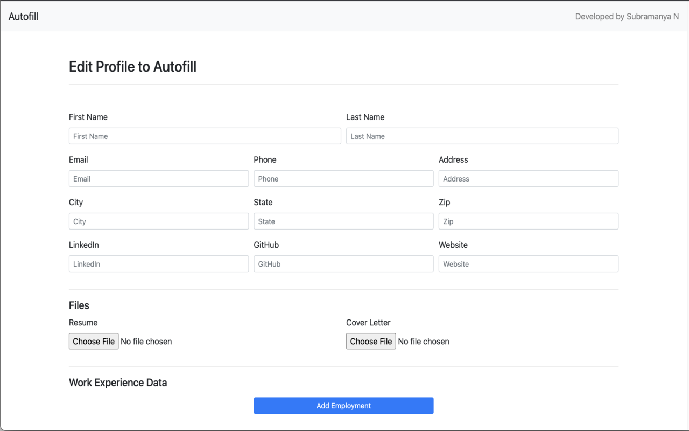

#  EZ Apply - Making Form Filling Effortless!

EZ Apply is a Chrome extension designed to streamline the job application process. With just a few clicks, you can autofill your personal and job-specific information into over 75 job application forms. The extension eliminates the tedious task of manually entering the same data across multiple websites.

### Features:
- **Autofill Text, Checkboxes, and Select Fields:** Automatically fill out various form fields with your saved information.
- **Resume and Cover Letter Upload:** Upload your resume and cover letter to job applications on supported platforms.
- **Privacy-Focused:** All information is securely stored locally on your Chrome browser. Your data is never shared or sent to external servers.
- **Cross-Site Compatibility:** Works with over 75+ job application platforms, including popular ones like Greenhouse and Lever.
- **Customizable:** Easily add, update, and manage your personal information with an intuitive user interface.

### How It Works:
1. Install the **EZ Apply** extension from the Chrome Web Store.
2. Create a profile by entering your personal and employment details.
3. When you encounter a job application form, click the **EZ Apply** extension icon and hit "Autofill."
4. Your data will be automatically filled in, leaving only job-specific fields for you to complete.

Currently, **EZ Apply** works best with platforms like Greenhouse, Lever, and more are being added frequently.

## Installation setup 
### Step 1.
```
 1. git clone https://github.com/SharkyBytes/EZ-Apply.git

```
### Step 2.
Inside chrome
```
1. Open Chrome and navigate to `chrome://extensions/`
2. Enable **Developer Mode** at the top right.
3. Click on **Load unpacked**.
4. Select the root directory of your cloned folder.
```

## File System
```
|- assets
    |- data.json : Current test data. 
|- js <br>
    |- autofill.js : logic for autofill
    |- companyData.js : get company data from url
    |- userData.js : get user data from file or storage
    |- manager.js : handels exection and data flow
    |- background.js : triggers when the button is clicked
|- manifest.json : config of the chrome extension  
```

### To-do
- [x] Autofill text, checkboxes, and select fields
- [x] Upload resume (works for Greenhouse, Lever)
- [x] Upload cover letter (works for Greenhouse, Lever)
- [x] Save data locally in Chrome storage (No data is collected from users)
- [ ] Add education fields (works for Greenhouse)

### Screenshots
1. **Popup**  
   

2. **Edit Profile**  
   
